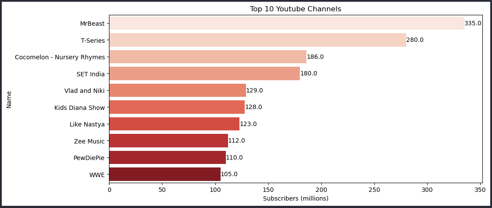
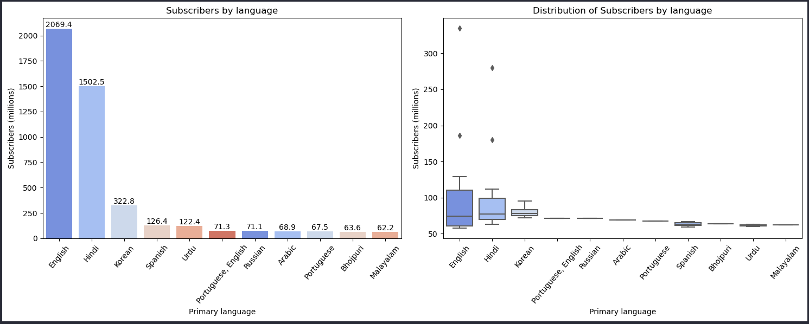
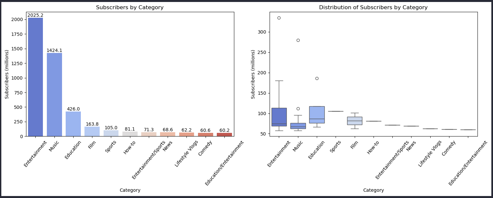
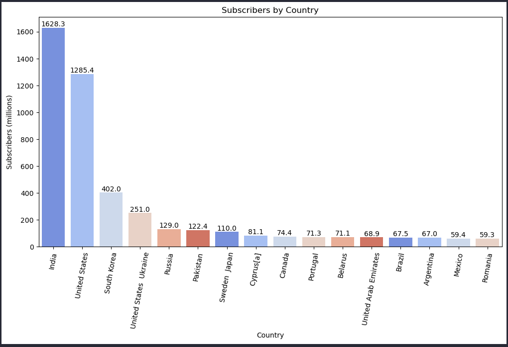

## Introduction

The goal of this project is to perform an exploratory data analysis of the top 50 YouTube channels with the most subscribers. For this purpose, the following Python libraries were utilized:

- Pandas
- Matplotlib
- Seaborn

## Data

You can find the dataset at the following link: https://www.kaggle.com/datasets/rashminslnk/youtube-subscribers-data-2024/data

## Analysis

### Top 10 YouTube channels

### Subscribers by Language / Distribution of Subscribers by Language

### Subscribers by Category / Distribution of Subscribers by Category

### Subscribers by Country

## Conclusion

The analysis revealed interesting trends. For instance:

- English dominates as the primary language among the top YouTube channels, demonstrating its global significance.

- Entertainment and Music categories are highly significant on YouTube.

- The top 50 channels represent a wide range of countries, emphasizing YouTube's global reach.