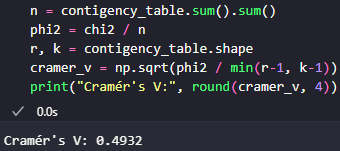

## Introduction

The goal of this project is to perform an exploratory data analysis of the top 50 YouTube channels with the most subscribers. For this purpose, the following Python libraries were utilized:

- Pandas
- NumPy
- Matplotlib
- Seaborn
- Missingno
- SciPy

## Data

You can find the dataset at the following link: https://www.kaggle.com/datasets/rashminslnk/youtube-subscribers-data-2024/data

## Data Loading and Cleaning

### Nulls

White lines indicate null values; gray lines indicate non-null values. Since there are no white lines, there are no nulls.

### Distribution of YouTube Channel Subscribers

This histogram shows the distribution of YouTube channel subscribers. The majority of channels fall within the 50 to 100 million range, with a peak closer to 50 million. Initially, the count is low, then it rises slightly before gradually declining, indicating that fewer channels have extremely high subscriber counts.

## Relationship Between Categorical Variables

### Relationship Between Language and Category

This heatmap shows the relationship between language and category. English Entertainment leads with 9 channels, followed by Hindi Music (6), Hindi Entertainment (5), and English Music (5). Other combinations have no more than 3 channels. It's interesting to see Hindi Music rank so high, as I initially expected English Music to be more dominant.

### Chi² contigency

The Chi² test checks if there is a relationship between language and category. The Chi² value (121.64) shows how different the observed data is from what we would expect if there were no relationship. A higher value means a bigger difference. The p-value (0.0696) tells us the chance that this difference happened by random chance. In statistics, a common threshold is 0.05-if the p-value is below this, we usually consider the result significant. Since 0.0696 is slightly above 0.05, we don't have strong enough evidence to say there is a definite relationship, but the result is close to being significant.

### Cramér's V

Cramér's V measures the strength of the relationship between two categorical variables, ranging from 0 (no association) to 1 (strong association). The result (0.4932) suggests a moderate connection between language and category. This means there is some relationship, but it is not very strong or absolute.

## Analysis

### Top 10 YouTube channels

### Subscribers by Language / Distribution of Subscribers by Language

The boxplot on the right shows how the data is distributed and helps identify outliers.

- The 'box' represents the middle 50% of the data (from the first quartile to the third quartile).
- The line inside the box is the median, which is the middle value.
- The 'whiskers' (lines extending from the box) show the range of most of the data, excluding outliers.
- Dots outside the whiskers are outliers, meaning they are unusually high or low compared to the rest of the data.

If the box is shifted to one side or the whiskers are uneven, it means the data is not evenly spread.

### Subscribers by Category / Distribution of Subscribers by Category

### Subscribers by Country

## Conclusion

The analysis revealed interesting trends. For instance:

- English dominates as the primary language among the top YouTube channels, demonstrating its global significance.

- Entertainment and Music categories are highly significant on YouTube.

- The top 50 channels represent a wide range of countries, emphasizing YouTube's global reach.